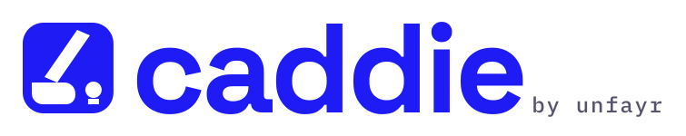

<p align="center">
  
</p>

<p align="center"><strong>Caddie reads the green. You sink the putt.</strong></p>

Caddie is a free Claude Code plugin for marketers, agencies and one-person businesses. It reads your Google Search Console, finds the pages sitting just off page one, and hands you the edits as paste-ready before-and-after blocks, with the evidence beside each one and a line that says how to check it worked. Nothing to sign up for, nothing that phones home, nothing that touches your site.

## Just ask

Install it, open Claude Code, and say:

> Run my site example.com through the entire Caddie process

The first time, Caddie walks you through connecting Google Search Console: about fifteen minutes of clicking in Google's console, one step at a time, and you only do it once. It gets to know your business from your own site, runs everything below, and opens a short report: your top five moves on page one, every other page as a checklist, the problems that repeat across the whole site, the questions your customers ask that the site does not answer, and what it checked. Next week, say the same sentence and it tells you what moved. `/caddie example.com` does the same thing.

Under that sentence, three commands share one data layer:

| Command | What it does | Status |
|---|---|---|
| `/find` | Striking-distance queries (positions 4 to 15) turned into edits, one file per page: new title, meta, a heading in the searcher's words, a 40 to 80 word answer, an FAQ when earned, and a brief for any topic that deserves its own page. | Ready |
| `/gaps` | The questions in your market that the site does not answer and AI assistants answer without you: question-form searches from Search Console, your market topics and your own list, each checked against your pages and against Gemini, ranked, with a brief per gap that has the first paragraph written. | Ready |
| `/monday` | A weekly memo: week-over-week Search Console and GA4, the status of every edit Caddie suggested (it re-fetches each page and checks whether the proposed text is live), the position moves on exactly those pages and queries, the pages that moved on their own, and three things to do this week. | Ready |

## What you get

Run `/find` and you get a folder like [docs/example-run](docs/example-run/summitplumbing.example/) for your own site: a `README.md` ranking the pages by the clicks they would gain at position 3, and one file per page that looks like this:

> **Why it sits here.** The best paragraph on the page, the one that says a bottom leak means a failed tank and what to do about it, is paragraph 11 under a heading called "Other Causes", while "water heater leaking from bottom" is the page's fastest-rising query (11.0 to 7.4, 1,900 impressions) and the title promises "Here's What to Do" when the H1 and most searches ask why.
>
> **Fix 1. Title.** Before: `Water Heater Leaking? Here's What to Do | Summit Plumbing`. After: `Why Is My Water Heater Leaking? Bottom, Top and Valve Leaks`. Why: matches the H1 and the queries; 59 characters.

Every change is small enough to paste in a minute, every number in the copy comes from your own page, and every file ends with which queries to watch in Search Console and when to expect movement.

Two PDFs come with every run, printed by the Chrome or Edge already on your machine, so nothing leaves it:

- **The Caddie Report**, about ten pages, for whoever decides: the five moves worth the most on page one, then a checklist of every other page, the site-wide problems, the new pages to write with their first paragraphs, and an honest page on what was checked. It opens on its own when the run finishes (set `CADDIE_NO_OPEN=1` to stop that).
- **The Implementation Pack**, for whoever makes the edits: every page laid out as a scorecard hole, with its read and every before-and-after block. [See a sample](docs/example-run/summitplumbing.example/runs/2026-10-07/find/report.pdf).

`/monday` is the part that remembers. A week after you make the edits, it tells you which ones are live, what their queries did, and what to do next, in a memo you can forward. [Read the sample memo](docs/example-run/summitplumbing.example/runs/2026-10-07/monday/memo.md).

## Try it in 90 seconds

No Google account, no API keys. Sample mode runs the whole pipeline on two fictional sites, a Boise plumber and a scheduling-software blog, from data in `fixtures/`.

```
git clone https://github.com/timlaneseo-tech/unfayr-caddie
cd unfayr-caddie
npm install
claude --plugin-dir .
```

Then in Claude Code:

```
/find --sample summitplumbing.example
```

Claude runs the scripts, reads the results, and writes ten page files into `sites/summitplumbing.example/runs/<today>/find/`. When it finishes, the scorecard report opens on its own; the `README.md` in that folder is the same ranking as a table. Try `--sample slotwise.example` for the SaaS blog. Then `/monday --sample summitplumbing.example` writes the weekly memo for it, using fixture pages where two of the suggested edits have been made so you can see what "applied" looks like.

## Set it up for your site

Say "Run my site example.com through the entire Caddie process" and Caddie guides you: it opens each Google Cloud page, says what to click, installs the file you download, signs you in, and checks each step before the next. About fifteen minutes, all free, once. Results go to `Documents/Caddie` (or `CADDIE_HOME`).

If you would rather do it by hand, [SETUP.md](SETUP.md) has the same steps as a checklist, and `node scripts/doctor.ts --site example.com` tells you what is still missing.

Optional, offered once during setup: a free Gemini API key adds the AI answer check, which asks Gemini the top questions each page should win and records what it answers and whether it mentions your site. Caddie stores the key in its own settings folder; `GEMINI_API_KEY` still works if you prefer it. Without a key everything else runs and the report says the check was skipped.

## What it costs

Nothing. Search Console and GA4 Data APIs are free. The Gemini free tier allows 500 requests a day on the default model, and Caddie caps itself at 150 a day across every site on your machine and stops politely when it gets near. All the reading, judging and writing happens inside your own Claude Code session on your own plan. There is no Anthropic API call anywhere in this repository.

One honest caveat. Since late 2026 Google no longer offers Grounding with Google Search on the Gemini free tier, so by default the AI check records Gemini's answers without citations. If you want to see which sites Gemini cites for each question, link a billing account to the key's project in AI Studio (Google then includes 5,000 grounded searches a month at no charge, and the tokens for 75 short questions cost a few cents) and set `"mode": "grounded"` under `ai` in `config.json`. Caddie never does this for you.

## What it never does

- Scrape Google Search, Google Maps, ChatGPT or any AI product's interface. It uses official APIs and fetches only your own candidate pages, once, with a user agent that says who it is.
- Phone home. No telemetry, no accounts, no hosted service. Delete the folder and it is gone.
- Write to your site. It writes markdown into `sites/<domain>/` in your working directory. You paste what you agree with.
- Invent facts. Prices, timeframes and claims in the proposed copy come from your page or your config; where your page has none, the copy says `[add yours]`.

## Install

**As a plugin** (slash commands appear as `/caddie:caddie`, `/caddie:find` and so on, or `/caddie`, `/find` when nothing else claims the name):

```
/plugin marketplace add timlaneseo-tech/unfayr-caddie
/plugin install caddie@caddie
```

Then open Claude Code anywhere and say "Run my site example.com through the entire Caddie process". Caddie installs what it needs the first time.

**For one session, from a clone:** `claude --plugin-dir ./caddie`.

**As a plain skills folder**, if you do not use plugins: copy `skills/` and `commands/` into your project's `.claude/` folder and point the commands at the clone. [docs/plain-skills.md](docs/plain-skills.md) has the two-minute version.

## How it works

Deterministic scripts (TypeScript, run directly by Node 22.18+, no build step) do the fetching and shaping:

- `scripts/gsc-pull.ts` pulls the last 28 days and the 28 before, by query, page and date, paginated past the 25,000-row limit and cached by date range.
- `scripts/find-candidates.ts` marks brand queries, scores every query by impressions times the CTR gap to position 3 (curve cited in `scripts/lib/ctr.ts`), sums by page, and flags queries that rank on a page that is not about them.
- `scripts/fetch-page.ts` fetches each candidate page and extracts title, meta, headings, paragraphs, FAQ and JSON-LD, with a content hash.
- `scripts/ai-check.ts` asks Gemini the top three questions per page and records the citations.
- `scripts/ledger.ts` records every proposed change in `sites/<domain>/ledger.json` with the page's content hash, so `/monday` can later report whether you made the edit and what moved.

Claude does the reading, diagnosing and writing, guided by three skills: `intent-match` (why a page sits where it sits), `answer-first-copy` (the quotable paragraph) and `page-diff` (the before-and-after format). `scripts/check-page.ts` lints the result before anything is recorded.

```
npm run check     # typecheck, tests, and a sample-mode /find end to end
```

## Decisions and plan

[CHANGELOG.md](CHANGELOG.md) lists what changed in each version. [PLAN.md](PLAN.md) is the implementation plan this was built from. [DECISIONS.md](DECISIONS.md) records every routine choice with its reason, from the CTR curve to why the credit line reads the way it does.

MIT licensed. Built by Unfayr · unfayr.com
